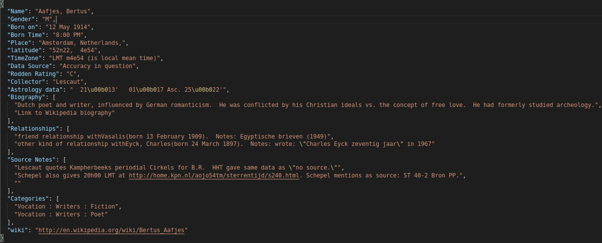

# astrobanca
Dati astrologici ricavati con scarping e convertiti in JSON a scopi di ricerca.

Dati scraped da [Astro-Databank](https://www.astro.com/astro-databank) a scopi di ricerca.

### Requisiti
- Python 3.7
- beautifulsoup4

### Esempio di pagina web estratta in formato json


<!--  |  -->

### Come usare questa repo
- **full_data.zip** contiene tutti i dati disponibili su astro.com
- Per prendere i dati uno a uno esegui
  ```
  $ python3 loopAllPage.py
  ```
- Per prendere i dati usando il multi-threading
  ```
  $ python3 multiprocessAllpage.py